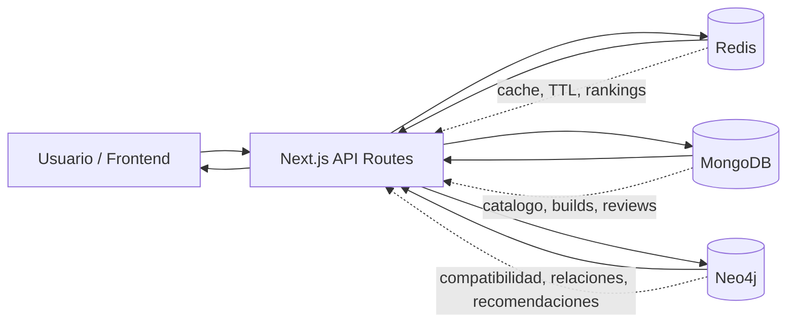

# Will It Run?

> Plataforma para disenar, validar y recomendar configuraciones de PC usando tres modelos de datos trabajando juntos: documentos, grafos y cache.

[](Will-It-Run/package.json)
[](Will-It-Run/tsconfig.json)
[](Will-It-Run/src/lib/models)
[](Will-It-Run/src/lib/queries)
[](Will-It-Run/src/lib/cache)

## La idea

Armar una PC no deberia sentirse como revisar veinte tabs, comparar sockets a mano y esperar que la fuente alcance. **Will It Run?** nace como una plataforma que toma una build, entiende sus componentes y responde preguntas concretas:

- Son compatibles entre si?
- Hay cuello de botella entre CPU y GPU?
- Que rendimiento relativo se puede esperar segun el perfil de uso?
- Que componente conviene recomendar despues de lo que el usuario ya eligio?
- Que builds de la comunidad se parecen o estan marcando tendencia?

El proyecto no intenta ser una tienda. No hay stock, compras ni precios como eje principal. La propuesta es mas interesante para la materia: convertir el armado de PCs en un problema de datos, relaciones, scoring y consultas.

## Que estamos construyendo

**Will It Run?** combina una app web con una capa backend en Next.js que orquesta tres bases especializadas:

| Motor | Rol en el sistema | Ejemplos dentro del proyecto |
|---|---|---|
| **MongoDB** | Catalogo documental y entidades flexibles | componentes, ensambles, reviews, builds de comunidad |
| **Neo4j** | Compatibilidad como grafo | sockets, chipsets, buses, memoria soportada, advertencias |
| **Redis** | Cache y rankings rapidos | resultados de compatibilidad, build score, componentes/builds trending |

La gracia del proyecto esta en que ninguna base queda como adorno. Cada una resuelve una parte distinta del dominio y la API las combina para entregar respuestas utiles.



## Alcance actual

Esta primera etapa se enfoca en la base tecnica del sistema:

- Catalogo de componentes por categorias: `cpu`, `gpu`, `motherboard`, `memory`, `storage`, `cooling`, `power`.
- Seeds para cargar datos iniciales en MongoDB y Neo4j.
- Modelos documentales con specs flexibles por categoria.
- Grafo de compatibilidad para sockets, chipsets, buses y memoria.
- Estrategia Redis-first para cachear consultas costosas y rankings.
- Endpoints backend para componentes, builds, compatibilidad, performance, recomendaciones, comunidad y healthcheck.
- Scoring inicial de builds con puntaje `0-100`, tier `S-D` y deteccion de cuello de botella.

El frontend visual todavia esta en etapa inicial. El foco actual del repositorio esta en la arquitectura de datos, la integracion entre motores y las consultas que sostienen la experiencia.

## Por que vale la pena inspeccionarlo

- **Tiene un dominio realista.** La compatibilidad de hardware no es una lista plana: depende de relaciones entre sockets, chipsets, memoria, buses, consumo y perfiles de uso.
- **Usa varias bases con criterio.** MongoDB guarda documentos flexibles, Neo4j modela relaciones y Redis acelera respuestas repetidas.
- **Hay integracion, no demos aisladas.** Las API routes conectan el catalogo, el grafo, el cache y el scoring.
- **Esta pensado para evolucionar.** El proyecto puede crecer hacia un configurador visual, recomendaciones por presupuesto, builds publicas y comparaciones entre configuraciones.

## Stack

- **Next.js 16** con App Router, TypeScript y Tailwind.
- **MongoDB + Mongoose** para datos documentales.
- **Neo4j + Cypher** para compatibilidad y recomendaciones.
- **Redis** para cache-aside, TTLs y sorted sets.
- **Docker Compose** para levantar las tres bases localmente.
- **Zod** para validar entradas de API.

## Como correrlo

El proyecto real vive dentro de la carpeta [`Will-It-Run/`](Will-It-Run/).

```bash
cd Will-It-Run
npm install
```

Crea el archivo de entorno local:

```powershell
Copy-Item .env.example .env.local
```

En macOS o Linux:

```bash
cp .env.example .env.local
```

Levanta las bases y carga los datos:

```bash
docker compose up -d
npm run seed:all
```

Arranca la app:

```bash
npm run dev
```

Puntos rapidos para verificar:

- App: <http://localhost:3000>
- Healthcheck: <http://localhost:3000/api/health>
- Componentes: <http://localhost:3000/api/components?cat=cpu>
- Neo4j Browser: <http://localhost:7474>
- MongoDB: `mongodb://127.0.0.1:27018/willitrun?directConnection=true`
- Redis: `localhost:6379`

## Estructura para explorar

```text
Will-It-Run/
|-- data/                    # datasets de seed para MongoDB y Neo4j
|-- consultas/               # consultas puras para practicar MongoDB y Cypher
|-- scripts/                 # seeds de MongoDB y Neo4j
|-- src/app/api/             # endpoints backend
|-- src/lib/models/          # modelos Mongoose
|-- src/lib/queries/         # queries Cypher
|-- src/lib/cache/           # claves, TTL y helpers Redis
|-- src/lib/simulation/      # scoring y deteccion de cuello de botella
|-- docker-compose.yml       # MongoDB, Neo4j y Redis
`-- README.md                # documentacion tecnica completa
```

## Documentacion interna

- [README tecnico](Will-It-Run/README.md): setup completo, endpoints, estructura y decisiones de implementacion.
- [Guia de bases de datos](Will-It-Run/GUIA_BDD.md): explicacion enfocada en MongoDB, Neo4j y Redis.
- [Consultas MongoDB](Will-It-Run/CONSULTAS_MONGO.md): consultas documentales para practicar y validar.
- [Consultas Neo4j](Will-It-Run/CONSULTAS_NEO4J.md): consultas Cypher sobre el grafo de compatibilidad.

## Equipo

Trabajo practico de **Ingenieria de Datos II - UADE (2026)**.

| Integrante | Foco principal |
|---|---|
| Martin Ferreira | liderazgo tecnico, infraestructura e integracion |
| Maximo Pena | modelo documental y MongoDB |
| Facundo Alvarez | grafo de compatibilidad y Neo4j |
| Tiziano Rodriguez | Redis, cache y rankings |
| Lorenzo Graglia | dataset, scoring y backend |
| Juan Fan | documentacion y pruebas |

## Estado

Repositorio en desarrollo activo. La base backend y de datos ya esta planteada; el siguiente salto natural es convertir esta arquitectura en una experiencia visual de armado y validacion de PCs.
